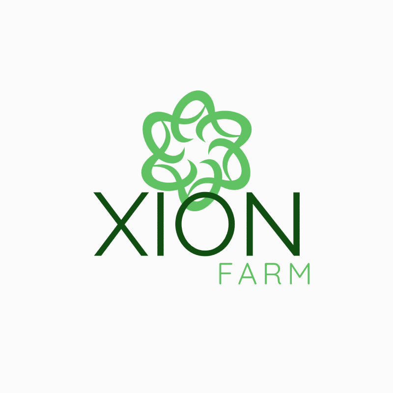

# XionFarm

<p align="center">
  
</p>

<p align="center">
  <strong>Revolutionizing Agriculture with Blockchain Technology</strong><br>
  Connecting farmers, consumers, and investors through transparent and sustainable technology
</p>

<p align="center">
  <a href="https://xion-farm.vercel.app">View Demo</a>
  ·
  <a href="https://github.com/fabiobrasileiroo/xion-farm/issues">Report Bug</a>
  ·
  <a href="https://github.com/fabiobrasileiroo/xion-farm/issues">Request Feature</a>
</p>

## 📋 Table of Contents

- [About the Project](#about-the-project)
  - [Built With](#built-with)
  - [Key Features](#key-features)
- [Getting Started](#getting-started)
  - [Prerequisites](#prerequisites)
  - [Installation](#installation)
  - [Smart Contract Deployment](#smart-contract-deployment)
- [Usage](#usage)
  - [Marketplace](#marketplace)
  - [Investments](#investments)
  - [AI Insights](#ai-insights)
  - [Blockchain Integration](#blockchain-integration)
  - [Gamification System](#gamification-system)
- [Project Structure](#project-structure)
- [Roadmap](#roadmap)
- [Contributing](#contributing)
- [License](#license)
- [Contact](#contact)
- [Acknowledgements](#acknowledgements)

## 🌱 About the Project

XionFarm is an innovative platform that connects small and medium farmers directly with consumers, retailers, and investors. By eliminating intermediaries and using blockchain technology, we ensure fair pricing, transparency, and sustainability throughout the agricultural supply chain.

Our mission is to create a more equitable, efficient, and environmentally responsible agricultural ecosystem.

### Stats

- **$12.5M** Total Value Locked
- **5,280+** Farmers
- **12,450+** Products
- **850+** Investors
- **120K+** Transactions

### Built With

- [Next.js](https://nextjs.org/) - React framework for the frontend
- [TypeScript](https://www.typescriptlang.org/) - Typed JavaScript
- [Tailwind CSS](https://tailwindcss.com/) - Utility-first CSS framework
- [XION Blockchain](https://xion.network/) - Zero gas fee blockchain platform
- [CosmWasm](https://cosmwasm.com/) - Smart contract platform for the Cosmos ecosystem
- [Rust](https://www.rust-lang.org/) - Programming language for smart contracts
- [Keplr Wallet](https://www.keplr.app/) - Blockchain wallet integration

### Key Features

#### 🔗 Blockchain Technology
Secure, transparent transactions with no gas fees using XION blockchain

#### 🤖 AI-Powered Insights
Predictive analytics for pricing, production optimization and early pest detection

#### 📝 Smart Contracts
Automated transactions and contractual guarantees for all parties

#### 🎮 Gamification System
Earn rewards for sustainable farming practices and transparent transactions

#### 🪙 Tokenization
Convert agricultural assets into digital tokens for fractional ownership and trading

## 🚀 Getting Started

To get a local copy up and running, follow these simple steps.

### Prerequisites

- Node.js (v16.0.0 or later)
- pnpm (v7.0.0 or later)
- Rust (for smart contract development)
- Keplr Wallet browser extension

### Installation

1. Clone the repository
   ```sh
   git clone https://github.com/fabiobrasileiroo/xion-farm.git
   cd xion-farm

Aqui está o texto no formato normal, sem o formato markdown:

---

**Install Dependencies**

To install dependencies and set up the project, follow the steps below:

1. **Install dependencies**:
   
   `sh pnpm install`

2. **Create a `.env.local` file with the following content**:

   `NEXT_PUBLIC_CONTRACT_ADDRESS=xion1...your_contract_address_after_deployment`

3. **Start the development server**:

   `sh pnpm dev`

4. Open your browser and go to [http://localhost:3000](http://localhost:3000) to view the app.

---

**Smart Contract Deployment**

The project includes a Rust-based CosmWasm smart contract for handling product listings, purchases, and other blockchain operations.

### Steps to deploy the smart contract:

1. **Navigate to the contract directory**:

   `sh cd xion-farm-contract`

2. **Build the contract**:

   `sh cargo build --target wasm32-unknown-unknown --release`

3. **Upload the contract to XION blockchain (testnet or mainnet)**:

   `sh xiond tx wasm store target/wasm32-unknown-unknown/release/xion_farm_contract.wasm --from <your-wallet> --chain-id <chain-id> --gas-prices 0.025uxion --gas auto`

4. **Instantiate the contract**:

   `sh xiond tx wasm instantiate <CodeID> '{}' --from <your-wallet> --chain-id <chain-id> --label "XionFarm Contract" --gas-prices 0.025uxion --gas auto`

5. **Obtain the contract address and update your `.env.local` file**.

---

**Usage**

**Marketplace**

The marketplace allows farmers to list their agricultural products and for consumers to purchase them directly. All transactions are recorded on the blockchain for transparency.

**Key Features**:
- List new agricultural products
- View detailed product information
- Purchase products with cryptocurrency
- Filter products by category, certification, and price
- Track product origin and supply chain

**Investments**

The investment platform allows investors to fund agricultural projects and earn returns on their investments.

**Key Features**:
- Browse investment opportunities
- View project details and expected ROI
- Invest in fractional ownership of agricultural assets
- Track investment performance
- Receive returns based on smart contract conditions

**AI Insights**

AI-powered analytics provide valuable insights for farmers, consumers, and investors.

**Key Features**:
- Price predictions for agricultural commodities
- Yield optimization recommendations
- Market demand forecasting
- Risk assessment for crops and investments
- Weather pattern analysis

**Blockchain Integration**

All transactions and certifications are recorded on the XION blockchain for transparency and security.

**Key Features**:
- Zero gas fee transactions
- Transparent transaction history
- Product verification and certification
- Tokenization of agricultural assets
- Smart contracts for automated agreements

**Gamification System**

The platform includes a gamification system to incentivize sustainable farming practices and platform engagement.

**Key Features**:
- Earn points for sustainable practices
- Unlock badges and achievements
- Compete on leaderboards
- Receive rewards and discounts
- Track progress and improvement

---

**Project Structure**

```
xion-farm/
├── app/                   # Next.js app router
│   ├── about/             # About page
│   ├── contact/           # Contact page
│   ├── dashboard/         # User dashboard
│   │   ├── ai-insights/   # AI analytics
│   │   ├── blockchain/    # Blockchain ledger
│   │   ├── gamification/  # Rewards system
│   │   ├── investments/   # Investment platform
│   │   ├── marketplace/   # Product marketplace
│   │   └── profile/       # User profile
│   ├── features/          # Features page
│   ├── login/             # Login page
│   └── signup/            # Signup page
├── components/            # React components
│   ├── about/             # About page components
│   ├── contact/           # Contact page components
│   ├── dashboard/         # Dashboard components
│   ├── features/          # Feature page components
│   ├── landing/           # Landing page components
│   └── ui/                # UI components library
├── hooks/                 # Custom React hooks
│   ├── use-blockchain.ts  # Blockchain integration hook
│   └── use-toast.ts       # Toast notifications hook
├── lib/                   # Utility functions
├── public/                # Static assets
├── services/              # Service modules
│   └── blockchain.ts      # Blockchain service
├── styles/                # Global styles
└── types/                 # TypeScript type definitions
    └── keplr.d.ts         # Keplr wallet type definitions

xion-farm-contract/        # Smart contract directory
├── src/                   # Contract source code
│   └── lib.rs             # Main contract file
└── Cargo.toml             # Rust package configuration
```

---

**Roadmap**

- Product Marketplace
- Smart contract for product listings and purchases
- Blockchain Integration with XION
- AI-powered insights
- Mobile App Development
- IoT integration for farm monitoring
- Expanded investment platform
- Enhanced gamification system
- Multilingual support
- Carbon Credit Marketplace

---

**Contributing**

Contributions are what make the open source community such an amazing place to learn, inspire, and create. Any contributions you make are **greatly appreciated**.

1. Fork the repository
2. Create your feature branch (`git checkout -b feature/AmazingFeature`)
3. Commit your changes (`git commit -m 'Add some AmazingFeature'`)
4. Push to your branch (`git push origin feature/AmazingFeature`)
5. Open a pull request

---

**License**

Distributed under the MIT License. See the [LICENSE](LICENSE) file for more information.

---

**Contact**

Your Name - [@your_twitter](https://twitter.com/your_twitter) - your_email@example.com  
Project Link: [https://github.com/fabiobrasileiroo/xion-farm](https://github.com/fabiobrasileiroo/xion-farm)

---

**Acknowledgments**

- XION Network
- Keplr Wallet
- CosmWasm
- Next.js
- Tailwind CSS
- Vercel

---

<p align="center"> <strong>XionFarm - Sustainable Agricultural Marketplace</strong><br> Connecting farmers, consumers, and investors through blockchain technology </p>
